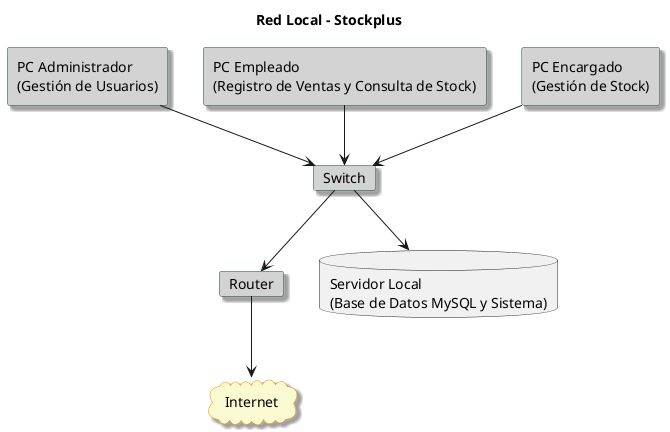

# Stockplus
Proyecto Universidad Siglo 21

### Materia 
#### Seminario de Práctica Informática

## Diagramas

### Cargar nueva categoria


### Cargar nuevo producto


### Cargar nuevo proveedor


### Registrar Venta
```plantuml
actor empleado
boundary ConsolaStockplus
control RegistrarVenta
entity Producto
entity Venta


empleado -> ConsolaStockplus: Selecciona Registrar Venta
activate ConsolaStockplus
loop n productos
ConsolaStockplus -> empleado: Solicita nombre del producto
empleado -> ConsolaStockplus: Ingresa nombre del producto
ConsolaStockplus -> RegistrarVenta: Valida existencia del producto
activate RegistrarVenta
RegistrarVenta -> Producto: Consultar producto
activate Producto
Producto --> RegistrarVenta: Devuelve Información
deactivate Producto
RegistrarVenta --> ConsolaStockplus: Confirma existencia
ConsolaStockplus -> empleado: Solicita cantidad
empleado -> ConsolaStockplus: Ingresa cantidad
ConsolaStockplus -> RegistrarVenta: Valida stock
RegistrarVenta --> ConsolaStockplus: Confirma disponibilidad
deactivate RegistrarVenta
ConsolaStockplus --> empleado: Muestra mensaje de aceptación
end

empleado -> ConsolaStockplus: Selecciona Finalizar
ConsolaStockplus --> empleado: Muestra detalle de venta
ConsolaStockplus -> empleado: Solicita correo electrónico del cliente
empleado -> ConsolaStockplus: Ingresa correo electronico
ConsolaStockplus -> RegistrarVenta: Valida correo electrónico
activate RegistrarVenta
RegistrarVenta --> ConsolaStockplus: Confirma correo electrónico
ConsolaStockplus -> empleado: Solicita confirmación de venta
empleado -> ConsolaStockplus: Confirma la venta
ConsolaStockplus -> RegistrarVenta: Actualiza información
RegistrarVenta -> Venta: Carga nueva venta
activate Venta
Venta --> RegistrarVenta: Confirma
deactivate Venta
loop n productos
RegistrarVenta -> Producto: Actualiza stock
activate Producto
Producto --> RegistrarVenta: Confirma
deactivate Producto
end 

RegistrarVenta -> RegistrarVenta: Envia correo de confirmación al cliente
RegistrarVenta --> ConsolaStockplus: Confirma operación
deactivate RegistrarVenta
ConsolaStockplus --> empleado: Muestra mensaje de confirmación


deactivate ConsolaStockplus
```

### Registrar venta - Alternativo S14
```plantuml
actor empleado
boundary ConsolaStockplus
control RegistrarVenta
entity Producto
entity Venta
entity Proveedor


empleado -> ConsolaStockplus: Selecciona Registrar Venta
activate ConsolaStockplus
loop n productos
ConsolaStockplus -> empleado: Solicita nombre del producto
empleado -> ConsolaStockplus: Ingresa nombre del producto
ConsolaStockplus -> RegistrarVenta: Valida existencia del producto
activate RegistrarVenta
RegistrarVenta -> Producto: Consultar producto
activate Producto
Producto --> RegistrarVenta: Devuelve Información
deactivate Producto
RegistrarVenta --> ConsolaStockplus: Confirma existencia
ConsolaStockplus -> empleado: Solicita cantidad
empleado -> ConsolaStockplus: Ingresa cantidad
ConsolaStockplus -> RegistrarVenta: Valida stock
RegistrarVenta --> ConsolaStockplus: Confirma disponibilidad
deactivate RegistrarVenta
ConsolaStockplus --> empleado: Muestra mensaje de aceptación
end

empleado -> ConsolaStockplus: Selecciona Finalizar
ConsolaStockplus --> empleado: Muestra detalle de venta
ConsolaStockplus -> empleado: Solicita correo electrónico del cliente
empleado -> ConsolaStockplus: Ingresa correo electronico
ConsolaStockplus -> RegistrarVenta: Valida correo electrónico
activate RegistrarVenta
RegistrarVenta --> ConsolaStockplus: Confirma correo electrónico
ConsolaStockplus -> empleado: Solicita confirmación de venta
empleado -> ConsolaStockplus: Confirma la venta
ConsolaStockplus -> RegistrarVenta: Actualiza información
RegistrarVenta -> Venta: Carga nueva venta
activate Venta
Venta --> RegistrarVenta: Confirma
deactivate Venta
loop n productos
RegistrarVenta -> Producto: Actualiza stock
activate Producto
Producto --> RegistrarVenta: Confirma
RegistrarVenta -> RegistrarVenta: Verifica limite minimo
  alt#Gold #LightGreen alcanza limite minimo

  RegistrarVenta -> Proveedor: Consultar Proveedor
  Proveedor --> RegistrarVenta: Devuelve informacion
  RegistrarVenta -> RegistrarVenta: Envia pedido al proveedor
 end
deactivate Producto
end 

RegistrarVenta -> RegistrarVenta: Envia correo de confirmación al cliente
RegistrarVenta --> ConsolaStockplus: Confirma operación
deactivate RegistrarVenta
ConsolaStockplus --> empleado: Muestra mensaje de confirmación

deactivate ConsolaStockplus
```

## Diagrama de clases


## Diagrama de clases de despliegue


### Diagrama Entidad-Relacion (DER)



